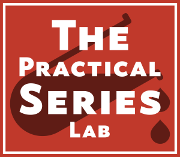

# hellow-world
Respository test

Hi Everyone,

This is KevinC2020. Trying to figure out how Github works and learn how to incorporate Github with machine learning project.
# A PracticalSeries Publication
     

    

     
The **Practical Series of publications** is a website resource for web developers and engineers. It contains a number of online publications designed to help and explain how to build a website, how to use version control and how to write engineering software for control systems.
     
## lab-brackets-git: How to use Brackets-Git
     
This is a demonstration (teaching) repository that explains how to manage a GitHub repository from within the Brackets text editor using the Brackets-Git extension.

The README.md should contain certain specific things:

    A title

    An Introduction (what the project is for)

    A Table of Contents (TOC)

    Instructions for use

    Installation instruction (if required)

    Links to other documentation (if not all contained here)

    List of contributors

    Licence (unless listed in another document)
